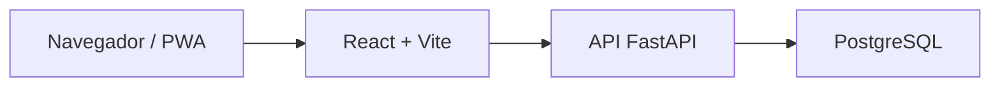

# Arquitetura do frontend

## Visão geral

O Merchant App Web é uma SPA React, mobile-first, distribuída como site estático e PWA. Regras de negócio, autenticação, validação e persistência pertencem à API FastAPI; o frontend compõe os fluxos e apresenta os dados.

O navegador nunca se conecta diretamente ao banco.

## Módulos entregues

| Módulo | Responsabilidade |
|---|---|
| `App.tsx` | Shell, cabeçalho, composição de rotas e status da API |
| `features/auth` | Cadastro, login, token e usuário atual |
| `features/products` | Busca, detalhe, cadastro e avaliações |
| `features/account` | Produtos e avaliações do usuário |
| `lib/api.ts` | Cliente HTTP, erros estruturados e timeout |
| `lib/router.ts` | Leitura de URL, histórico e rotas da SPA |
| `lib/useModalDialog.ts` | Foco, Escape e contenção de teclado em modais |

Os módulos de funcionalidade chamam pequenos adaptadores de API. Os componentes não conhecem detalhes de banco ou infraestrutura.

## Estado e navegação

- O estado de autenticação vive em `AuthProvider`.
- O token é persistido no `localStorage` e enviado como Bearer token.
- Dados de telas ficam em estado local e são recarregados após mutações.
- A navegação usa a History API, com rewrite do Render para `index.html`.
- Rotas autenticadas mostram uma solicitação de login quando não há usuário.

## API e erros

`apiRequest` centraliza URL, cabeçalhos, JSON, Bearer token, respostas sem conteúdo e o contrato de erro da API. Solicitações são canceladas após 15 segundos e sinais externos de cancelamento são preservados.

As telas representam quatro estados explícitos quando aplicável: carregamento, sucesso, vazio e erro. Erros de ações em modal são apresentados no próprio modal.

## Acessibilidade

- Modais usam `role="dialog"`, nome acessível e `aria-modal`.
- O foco entra no modal, permanece contido, fecha com `Escape` e retorna ao acionador.
- Abas expõem `tablist`, `tab` e `tabpanel`, além de navegação por setas.
- Estados assíncronos e erros usam regiões vivas ou alertas.
- Foco visível e controles com tamanho confortável são definidos globalmente.

## PWA e cache

O manifesto define nome, cores e ícones da identidade editorial. O service worker:

1. pré-carrega o shell mínimo;
2. remove caches de versões anteriores;
3. usa rede primeiro em navegações e atualiza o HTML salvo;
4. usa o cache visitado para ativos quando a rede não está disponível.

O PWA oferece fallback do shell, não uma experiência de dados totalmente offline. Busca, autenticação e mutações continuam dependendo da API.

## Qualidade e entrega

- Vitest cobre utilitários, cliente HTTP e comportamento de componentes.
- Playwright valida busca, navegação, acesso e exclusão em viewport desktop e móvel, com API simulada.
- O GitHub Actions instala dependências com `npm ci`, roda as duas suítes, verifica tipos e gera o build.
- A `main` dispara deploy automático no Render.

## Segurança

O Render configura CSP, política de referência, restrições de permissões e `nosniff`. A CSP permite apenas o app, a API publicada e as fontes declaradas.

O token em `localStorage` reduz complexidade no MVP, mas fica acessível a JavaScript executado na origem. A aplicação evita HTML arbitrário e aplica CSP; para um produto com maior exposição, cookies HttpOnly emitidos pelo backend são a evolução preferível.

## Decisões e limites

- Sem framework de rotas: a implementação atual é pequena e testada; um roteador dedicado passa a fazer sentido com rotas aninhadas ou layouts múltiplos.
- Sem estado global de servidor: os fluxos atuais são curtos; cache de dados compartilhado pode ser introduzido quando houver invalidação mais complexa.
- Sem acesso direto ao Supabase: mantém regras e autorização concentradas no backend.
- Sem imagens e offline completo: permanecem evoluções, não requisitos do MVP atual.
