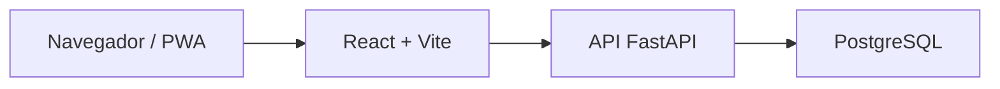

# Arquitetura do frontend

## Visão geral

O Merchant App Web é uma SPA React, mobile-first, distribuída como site estático e PWA. O celular é a base dos estilos; tablet (≥ 768 px) e computador (≥ 1024 px) têm layouts próprios em `src/responsive.css`, com navegação no topo no computador. Regras de negócio, autenticação, validação e persistência pertencem à API FastAPI; o frontend compõe os fluxos e apresenta os dados.

```mermaid
flowchart LR
  U["Navegador / PWA"] --> W["React + Vite"]
  W --> A["API FastAPI"]
  A --> D["PostgreSQL"]
```

O navegador nunca se conecta diretamente ao banco.

## Módulos entregues

| Módulo | Responsabilidade |
|---|---|
| `App.tsx` | Shell, cabeçalho, composição de rotas e status da API |
| `features/auth` | Cadastro, login, token e usuário atual |
| `features/products` | Busca, detalhe, cadastro e avaliações |
| `features/account` | Produtos e avaliações do usuário |
| `lib/api.ts` | Cliente HTTP, erros estruturados e timeout |
| `lib/router.ts` | Leitura de URL, histórico e rotas da SPA |
| `lib/useModalDialog.ts` | Foco, Escape e contenção de teclado em modais |

Os módulos de funcionalidade chamam pequenos adaptadores de API. Os componentes não conhecem detalhes de banco ou infraestrutura.

## Estado e navegação

- O estado de autenticação vive em `AuthProvider`.
- A sessão vive num cookie HttpOnly emitido pela API (`merchant_session`); o JavaScript nunca vê o token. Ao abrir, o app pergunta à API quem está conectado (`GET /users/me`).
- Quem entrou por uma versão anterior tem o token do `localStorage` trocado pelo cookie (`POST /auth/session`) e apagado, sem digitar a senha de novo. "Sair" chama `POST /auth/logout`, que apaga o cookie.
- Dados de telas ficam em estado local e são recarregados após mutações.
- A navegação usa a History API, com rewrite do Render para `index.html`.
- Rotas autenticadas mostram uma solicitação de login quando não há usuário.

## API e erros

`apiRequest` centraliza caminhos relativos, cabeçalhos (inclusive `X-Merchant-Client`, exigido pela API em escritas autenticadas por cookie), JSON, respostas sem conteúdo e o contrato de erro da API. Solicitações são canceladas após 15 segundos e sinais externos de cancelamento são preservados.

As telas representam quatro estados explícitos quando aplicável: carregamento, sucesso, vazio e erro. Erros de ações em modal são apresentados no próprio modal.

## Acessibilidade

- Modais usam `role="dialog"`, nome acessível e `aria-modal`.
- O foco entra no modal, permanece contido, fecha com `Escape` e retorna ao acionador.
- Abas expõem `tablist`, `tab` e `tabpanel`, além de navegação por setas.
- Estados assíncronos e erros usam regiões vivas ou alertas.
- Foco visível e controles com tamanho confortável são definidos globalmente.

## PWA e cache

O manifesto define nome, cores e ícones da identidade editorial. O service worker:

1. pré-carrega o shell mínimo;
2. remove caches de versões anteriores;
3. usa rede primeiro em navegações e atualiza o HTML salvo;
4. usa o cache visitado para ativos quando a rede não está disponível.

O PWA oferece fallback do shell, não uma experiência de dados totalmente offline. Busca, autenticação e mutações continuam dependendo da API.

## Qualidade e entrega

- Vitest cobre utilitários, cliente HTTP e comportamento de componentes.
- Playwright valida busca, navegação, acesso e exclusão em viewport desktop e móvel, com API simulada.
- O GitHub Actions instala dependências com `npm ci`, roda as duas suítes, verifica tipos e gera o build.
- A `main` dispara deploy automático no Render.

## Segurança

O Render configura CSP, política de referência, restrições de permissões e `nosniff`. A CSP permite conexões apenas com a própria origem (`connect-src 'self'`) e as fontes declaradas.

A API responde na mesma origem do site: o Render repassa `/api/*` e `/health` ao serviço da API. Como `onrender.com` está na Public Suffix List, um cookie emitido direto pelo subdomínio da API seria de terceiros para o site e bloqueado pelos navegadores; com o rewrite, ele é primário.

O token de sessão fica num cookie `HttpOnly`, `SameSite=Lax`, `Secure` e restrito a `/api`: um script injetado não consegue lê-lo nem enviá-lo para fora. Contra CSRF, além do `SameSite`, a API recusa escritas autenticadas por cookie sem o cabeçalho `X-Merchant-Client`, que um formulário de outro site não consegue enviar. Decisão em [ADR-0016](https://github.com/vsys-val/fastapi-merchant-app/blob/main/docs/decisoes/0016-sessao-em-cookie-httponly.md).

## Decisões e limites

- Sem framework de rotas: a implementação atual é pequena e testada; um roteador dedicado passa a fazer sentido com rotas aninhadas ou layouts múltiplos.
- Sem estado global de servidor: os fluxos atuais são curtos; cache de dados compartilhado pode ser introduzido quando houver invalidação mais complexa.
- Sem acesso direto ao Supabase: mantém regras e autorização concentradas no backend.
- Sem imagens e offline completo: permanecem evoluções, não requisitos do MVP atual.
