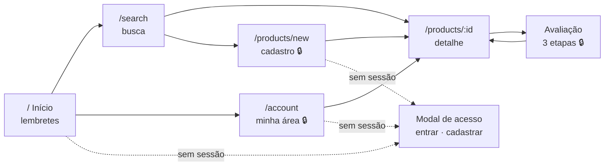

# Jornadas e telas

Este documento liga cada tela da interface às necessidades que ela atende. A documentação de produto e de requisitos fica no repositório da API:

- [Visão de produto](https://github.com/vsys-val/fastapi-merchant-app/blob/main/docs/visao-produto.md): problema, personas, métricas
- [Histórias de usuário](https://github.com/vsys-val/fastapi-merchant-app/blob/main/docs/historias-usuario.md) (US01–US13) com critérios de aceite
- [Matriz de rastreabilidade](https://github.com/vsys-val/fastapi-merchant-app/blob/main/docs/rastreabilidade.md): requisito → endpoint → teste → tela
- [Decisões (ADRs)](https://github.com/vsys-val/fastapi-merchant-app/blob/main/docs/decisoes/README.md)

## Dois contextos, duas posturas de interface

A [ideação](https://github.com/vsys-val/fastapi-merchant-app/blob/main/docs/ideacao.md) identificou dois momentos de uso com necessidades opostas. A interface foi desenhada para cada um:

| | **No corredor** (decidir) | **Em casa** (registrar) |
|---|---|---|
| Situação | Pressa, uma mão, celular | Calma, depois de usar o produto |
| Objetivo | Chegar à resposta em poucos toques | Registrar com cuidado, sem erro |
| Decisões de interface | Leitura sem login · busca em destaque na home · código de barras com teclado numérico · intenção de recompra já no card do resultado | Formulário em 3 etapas · validação por etapa · conferência antes de publicar · confirmação para excluir |

## Mapa de navegação

🔒 exige sessão. Sem sessão, a rota mostra um convite para entrar em vez dos dados.

## Telas

| Tela | Rota / componente | Histórias | Requisitos | Estados tratados | Testes |
|---|---|---|---|---|---|
| Início | `/` · `HomeView` em `App.tsx` | US12 | RF14, RF15 | visitante · carregando · sem avaliações · com lembretes · erro · API offline | e2e `merchant.spec.ts`, `production.spec.ts` |
| Modal de acesso | `AuthPanel` | US01, US02 | RF01, RF02 | login · cadastro · enviando · erro da API | e2e (teclado, foco, Esc) |
| Busca | `/search` · `ProductSearch` | US03, US04 | RF03, RF04 | sem busca · buscando · vazio · resultados paginados · erro | e2e |
| Detalhe | `/products/:id` · `ProductDetailView` | US04, US05, US11 | RF05, RF11, RF12 | carregando · não encontrado · com/sem avaliação própria · comunidade vazia · paginação | `ProductDetailView.test.tsx`, e2e |
| Avaliação | `ReviewForm` | US09, US10 | RF08, RF09 | etapa 1 · etapa 2 · conferência · validação por etapa · erro ao salvar | cobertos pela API (T18–T21) |
| Cadastro de produto | `/products/new` · `ProductForm` | US06 | RF06 | formulário · salvando · duplicata com atalho para o produto existente · erro de validação | `ProductForm.test.tsx`; API (T08–T11) |
| Minha área | `/account` · `AccountDashboard` | US13 | RF14 | carregando · vazio · lista · paginação · erro | cobertos pela API (T28) |

## Decisões de UX e sua origem

| Decisão | Motivo | Origem |
|---|---|---|
| Avaliação em **3 etapas** (experiência → motivos → conferência) | A ideação atribuiu à interface a tela de confirmação. Dividir reduz a carga no celular e valida cedo | Ideação, "Responsabilidades da API e da interface" · [ADR-0001](https://github.com/vsys-val/fastapi-merchant-app/blob/main/docs/decisoes/0001-avaliacao-estruturada-sem-nota.md) |
| Rótulos semânticos ("Compraria novamente", "Justo") em vez de números | Os valores da API são controlados; a interface os traduz sem inventar escala | [ADR-0001](https://github.com/vsys-val/fastapi-merchant-app/blob/main/docs/decisoes/0001-avaliacao-estruturada-sem-nota.md) |
| "Sua experiência" antes de "Avaliações da comunidade" | A opinião própria é o sinal mais forte para a recompra | [ADR-0006](https://github.com/vsys-val/fastapi-merchant-app/blob/main/docs/decisoes/0006-avaliacao-pessoal-separada.md) |
| Card da busca mostra **a sua** intenção ou, sem ela, a intenção predominante da comunidade | Responde "compro de novo?" sem abrir o produto | [ADR-0002](https://github.com/vsys-val/fastapi-merchant-app/blob/main/docs/decisoes/0002-intencao-de-recompra-como-resumo.md) |
| Aviso "Sua avaliação será pública com seu nome de exibição" na conferência | Consentimento informado sobre a autoria pública | [ADR-0009](https://github.com/vsys-val/fastapi-merchant-app/blob/main/docs/decisoes/0009-leitura-publica-escrita-autenticada.md) |
| Confirmação modal para excluir avaliação, com foco no "Cancelar" | Ação irreversível: o padrão seguro é não excluir | RN28 (sem histórico) |
| Cor **e** ícone **e** texto no status de recompra | Não depender só de cor (acessibilidade) | `design-qa.md` |
| Navegação inferior com 3 destinos | Alcance do polegar no celular; arquitetura de informação validada no protótipo | [Protótipo mobile](mobile-prototype.md) |
| Leitor de código pela câmera **ausente** | Fora do escopo desta versão; a CSP também bloqueia a câmera | [Roadmap](https://github.com/vsys-val/fastapi-merchant-app/blob/main/docs/roadmap.md) |

## Lacunas conhecidas

A API oferece mais do que a interface usa hoje. As lacunas são deliberadas e estão priorizadas no roadmap:

| Capacidade da API | Situação na interface | Roadmap |
|---|---|---|
| Filtro por categoria e busca combinada (RF04) | Um campo por vez | Agora |
| Corrigir produto (RF07) | Sem tela | Agora |
| Excluir produto (RF13) | Sem tela | Próximo |

## Critérios de qualidade de interface

- Funciona de 320 px a desktop sem rolagem horizontal ([design-qa.md](../design-qa.md)).
- Operável por teclado: modais com foco contido, `Esc` e retorno do foco; abas com setas.
- Toda tela assíncrona trata carregando, vazio, sucesso e erro.
- Mensagens de erro vêm da API em português e aparecem próximas à ação que falhou.
